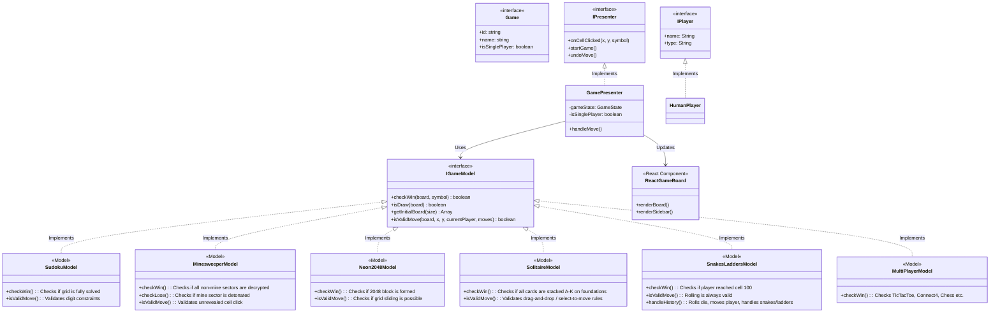

# Single-Player Games Architecture Plan

Here is the architectural plan for integrating **Single-Player Games** (ألعاب فردية) like Sudoku, 2048, or Solitaire into our existing MVP structure. The goal is to reuse our powerful MVP framework without breaking the 2-player logic.

## 1. Core Architecture Changes

### A. Game Metadata (`types.ts`)
We will add a new property `isSinglePlayer?: boolean` to the `Game` interface. 
This tells the system how to handle setup and UI.

### B. The Presenter (`GamePresenter.ts`)
Currently, `GamePresenter` flips the turn after every move: `activePlayerIndex = 0 -> 1 -> 0`.
We will modify the `handleMove` logic:
- **If `isSinglePlayer` is true:** We **do not** switch turns. The `activePlayerIndex` remains `0`.
- The `checkWin` and `isDraw` functions will evaluate if the puzzle is solved or if there are no moves left.

### C. Player Setup (`PlayerSetup.tsx`)
When a user selects a Single-Player game from the menu:
- The `PlayerSetup` screen will **hide the Opponent section completely**.
- It will only ask for "Your Name" and launch the game immediately.

### D. Game Board UI (`GameBoard.tsx`)
- The sidebar will detect `players.length === 1` or `currentGame.isSinglePlayer`.
- It will hide the second player's stats/panel.
- "Turn" indicators will be hidden since it's always the human's turn.

## 2. Updated Architecture Diagram

## User Review Required
> [!IMPORTANT]
> This architecture ensures that **Single-Player Games** will fit perfectly into the SOLID design we already built without duplicating code.
> 
> What do you think of this architecture? Also, **which specific single-player games** would you like to add first? (e.g., Sudoku, 2048, Sliding Puzzle, etc.)
